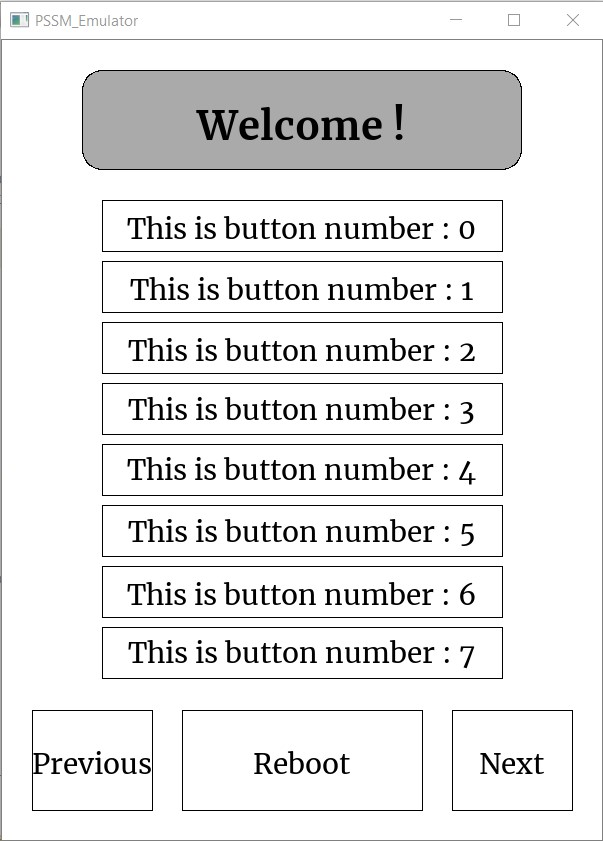

# Python-Screen-Stack-Manager
PSSM - A handy tool to create an image-based user interface with easier layer control.
It makes an extensive use of PIL (Pillow) to handle images.
If you need to run it on a Kobo/Kindle, you require FBInk and pyFBink.
If you need to test it on a computer, you need OpenCV.

**Warning** - I am no python expert, I had to work around quite a few simple issues. Do not expect the code to be work perfectly out of the box, nor to be written elegantly.

### Why have I made this ??
This tool was made to be used on Kobo e-readers.  
They are handheld devices running Linux, so people were able to run Python on it.   
However, no standard or up-to-date librairy will handle printing things on a their EInk framebuffer. Luckily NiLuJe provided a tool to print images on the screen and python (and Go and Lua) bindings to use it : [FBInk](https://github.com/NiLuJe/FBInk).  
So I made this tool to handle the creation of a user interface. Because being able to print things is nice, but when it comes to building a full menu, it can be very long and annoying, as you have to code every single line on the screen with a few lines of code.  
PSSM handles that for you. I drew inspiration from PySimpleGUI, because I really liked how simple it was to build a basic layout with it. I did however add a few features which allow to place elements exactly where you want on the screen, in order to match my needs.  


### Documentation
Have a look here :
[Documentation](https://mavireck.github.io/Python-Screen-Stack-Manager/index.html)  
And here :
[Examples](examples/)

### Images are worth thousands words
Here is a demo code :
```Python
import pssm

buttons     = [{'text':'This is button number : ' + str(n)} for n in range(8)]
buttonList  = pssm.ButtonList(buttons=buttons, margins=[30,30,100,100], spacing=10)
button_welcome  = pssm.Button(text="Welcome !",radius=20, font = pssm.Merri_bold, font_size = "h*0.05", background_color="gray10")
button_previous = pssm.Button("Previous")
button_reboot   = pssm.Button("Reboot")
button_next     = pssm.Button("Next")
menu = [
    [30                                                                                                             ],
    [100,            (None,80),                       (button_welcome,"?"),                    (None,80)            ],
    ["?",                                               (buttonList,"?")                                            ],
    [100,(None,30), (button_previous,"?*1"), (None,30), (button_reboot,"?*2"), (None,30), (button_next,"?*1"), (None,30)  ],
    [30                                                                                                             ]
]

# Intialize PSSM
screen = pssm.PSSMScreen("Kobo",'Main')
screen.clear()        # Clears the screen
screen.refresh()      # Refreshes the screen

# After having initialized everything, it is time to initialize a Layout Element based on the
# layout you have created.
myLayout = pssm.Layout(menu,screen.area)
# You can then add the main layout to the screen, to actually print it.
screen.addElt(myLayout)
```
And here is what you get :


The code is probably not very clear on the first look.  
Basically, it is a row x columns matrix.  
The first element of each row is the height of the row:  
- The first row has height 30 pixels
- The second : "h*0.1" :  0.1 times the screen height
- The third : "?" : Let PSSM guess the appropriate height in order to occupy most of the screen size.
- The forth : "p*100" : another way of indicating a 100 pixels

Of course this way of programming heights also works with the widths.  

Then, in each row, every Tuple represent an element. Here I just displayed buttons, but other elements exist. The tuple is of shape (pssm.Element, width), where width is, as you can guess, the element's width.
