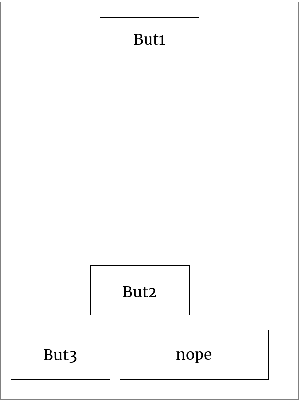

# Python-Screen-Stack-Manager
PSSM - A handy tool to create an image-based user interface with easier layer control.
It makes an extensive use of PIL (Pillow) to handle images.
If you need to run it on a Kobo/Kindle, you require FBInk and pyFBink.
If you need to test it on a computer, you need OpenCV

**Warning** - I am no python expert, I had to work around quite a few simple issues. Do not expect the code to be work perfectly out of the box, nor to be written elegantly.

### What it does
Look at the test file for an example.  
A first, this librairy was only meant to help stack pillow images on the screen (hence the name), allowing you to remove an object which partially hidden behind another, without you having to redraw everything.  
However, I decided to make it a lot more powerful.  


### Documentation
Have a look here :
[Documentation](DOCS/HELP.md)

### Images are worth thousands words
Here is a demo code :
```Python
import pssm

layout_demo = [
    [30                                                                                         ],
    ["h*0.1", (None,"?/2"),        (pssm.Button("But1"),200),        (None,"?/2")               ],
    ["?"                                                                                        ],
    ["p*100", (None,"w*0.3"),       (pssm.Button("But2"),200),        (None,"w*0.3")            ],
    [30                                                                                         ],
    [100, (None,20), (pssm.Button("But3"),200), (None,20), (pssm.Button("nope"),300), (None,10) ],
    [40                                                                                         ]
]
# Intialize PSSM
screen = pssm.PSSMScreen("Kobo",'Main')
screen.clear()        # Clears the screen
screen.refresh()      # Refreshes the screen
# You can then add the main layout to the screen:
myLayout = pssm.Layout(layout_demo,screen.area)
screen.addElt(myLayout)
```
And here is what you get :


The code is probably not very clear on the first look.  
Basically, it is a row x columns matrix.  
The first element of each row is the height of the row:  
- The first row has height 30 pixels
- The second : "h*0.1" :  0.1 times the screen height
- The third : "?" : Let PSSM guess the appropriate height in order to occupy most of the screen size.
- The forth : "p*100" : another way of indicating a 100 pixels

Of course this way of programming heights also works with the widths.  

Then, in each row, every Tuple represent an element. Here I just displayed buttons, but other elements exist. The tuple is of shape (pssm.Element, width), where width is, as you can guess, the element's width.
